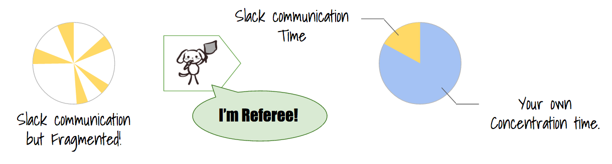
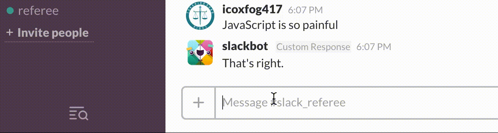
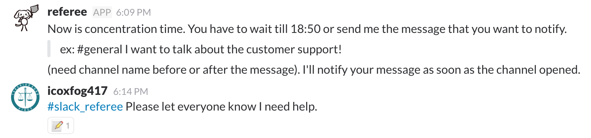
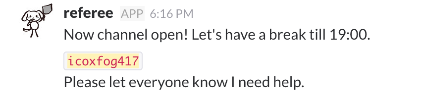
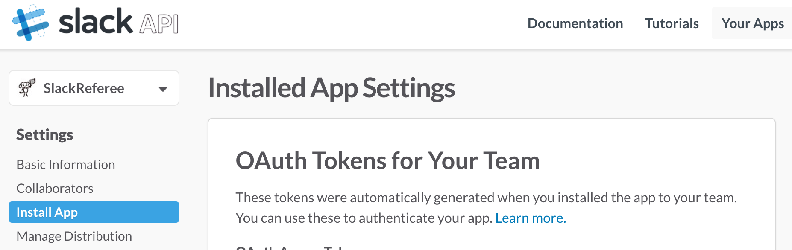
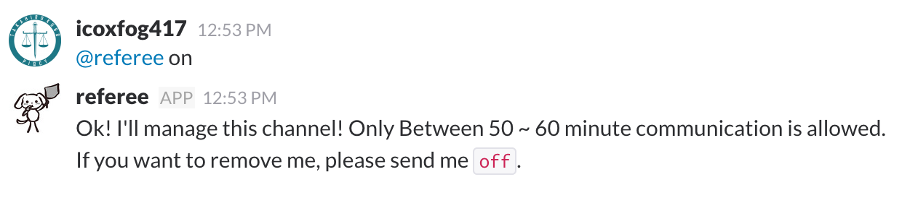

# slack-referee

Slack Referee resolves slack communication fragmentation by restricting the communication time.

## Feature

### Erases all remarks except communication time

So strict referee! But you don't need to be so afraid.  
You can ask the referee to share the message by following feature.

### Record the message that you want to share at the next communication time

When you send the message to referee, referee will react to it and record your message.  
And recorded message is shared when the channel opens!

## How to use

You need two slack key.

* Bot API key (for the bot)
* Web API key (to delete the message)

To get these key, you have to make Slack App and integrate it to your team.  
Please refer below document.

[Building internal integrations for your team](https://api.slack.com/internal-integrations)

You can create your App from [here](https://api.slack.com/apps).  
Once you create and installed it to your team, you can get keys!
You can confirm these at your app's Installed App Tab.

Then, you can run the Slack Referee.

* Run on Heroku: Push Heroku Button and set environmental variables
  * Notify free Heroku dyno has some limitation about operating time and file storage.
* Run on your local: Clone this repository and run below command.
  * `npm install` then
  * `node referee.js`
  * (you have to set environmental variables or set it from command line like `bot_token=xxx api_token=xxx node referee.js`)

Now, invite slack referee to your channel, and send `on` to activate it!

Enjoy!
